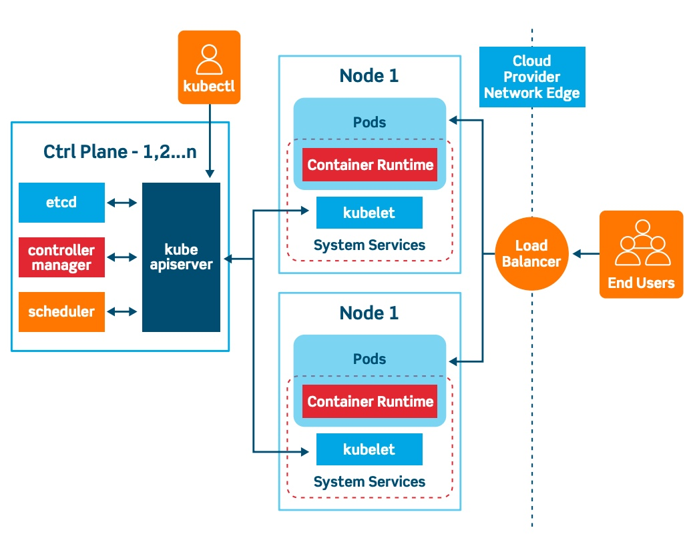

# Kubernetes Infrastructure

## Control plane
Typically executed by a master node, which can optionally be used to schedule user workloads. If the k8s cluster is managed by the cloud provider, the user doesn't have access to the control plane. 

The control plane's components make global decisions about the cluster (for example, scheduling), as well as detecting and responding to cluster events (for example, starting up a new pod when a Deployment's replicas field is unsatisfied).

### kubeapi server

Is the central component of the Kubernetes control plane. It acts as the primary interface for managing the Kubernetes cluster.
The kube-apiserver handles authentication and authorization for all requests to the Kubernetes API. The kube-apiserver serves as the primary source of truth for the cluster's state. It stores and manages the state of all Kubernetes objects, including their configurations, status, and relationships with other objects. Other components of the control plane, such as the scheduler and controller manager, interact with the kube-apiserver to read and update the cluster state.

Kube-apiserver is designed to scale horizontally—that is, it scales by deploying more instances. You can run several instances of kube-apiserver and balance traffic between those instances.

### controller manager

It is responsible for managing various controllers that regulate the state of the cluster and ensure that the desired state specified by users is continuously maintained.

1) Controller Loops: The controller manager runs multiple control loops, each responsible for managing a specific aspect of the cluster's state. These controllers continuously watch the state of the cluster and take action to reconcile any differences between the current state and the desired state specified in Kubernetes resources.

2) Node Controller: The node controller monitors the state of nodes in the cluster and takes action to ensure that the desired number of nodes is maintained. It detects node failures and replaces them with new nodes as necessary.

2) Replication Controller/ReplicaSet Controller: The replication controller (in older Kubernetes versions) or the ReplicaSet controller (in newer versions) ensures that the specified number of pod replicas is running at all times. It monitors the state of pods and creates or deletes replicas as needed to maintain the desired replica count.

4) Deployment Controller: The deployment controller manages deployments, which are higher-level abstractions that specify how applications should be deployed and updated in the cluster. It ensures that the desired number of replicas specified in a deployment's configuration is running and handles updates and rollbacks of application versions.

5) Service Account and Token Controllers: These controllers manage service accounts and associated authentication tokens within the cluster, ensuring that pods have the necessary credentials to access other cluster resources securely.

6) Namespace Controller: The namespace controller monitors the creation and deletion of namespaces within the cluster and ensures that associated resources are properly managed.

7) Custom Controllers: In addition to built-in controllers, users can create custom controllers to implement custom logic for managing specific resources or enforcing custom policies within the cluster. These custom controllers can be deployed and managed by the controller manager.

### scheduler

Is a key component of the Kubernetes control plane responsible for placing newly created pods onto nodes in the cluster.  The scheduler is designed to handle large-scale clusters with thousands of nodes and tens of thousands of pods. It employs efficient algorithms and caching mechanisms to optimize scheduling performance and minimize latency.

Factors taken into account for scheduling decisions include: individual and collective resource requirements, hardware/software/policy constraints, affinity and anti-affinity specifications, data locality, inter-workload interference, and deadlines.
The scheduler may prioritize certain pods over others based on priority classes defined in their pod specifications. Once the scheduler identifies a suitable node for the pod, it binds the pod to that node by updating the pod's status in the Kubernetes API server. This informs other components of the cluster that the pod has been scheduled and should be started on the selected node.

### etcd

Consistent and highly-available key value store used as Kubernetes' backing store for all cluster data. etcd stores critical information about the state of the Kubernetes cluster, including configuration data, metadata about pods, services, nodes, and other resources, as well as information about the cluster's current state.
etcd provides a watch API that allows Kubernetes components and external clients to subscribe to changes in the data store. This enables real-time notifications of changes to resources, allowing Kubernetes components to react and take appropriate actions accordingly.

If your Kubernetes cluster uses etcd as its backing store, make sure you have a back up plan for the data.

## Data plane

The user workload is scheduled generally in worker nodes, which are managed by the customer and takes full responsibility when working in a Cloud environment (such as EKS/AKS/GKE).

### kubelet

Is an agent that runs on each node in the cluster. It makes sure that containers are running in a Pod and enforces resource limits and allocates resources based on pod specifications and node capacity. It is responsible for managing the lifecycle of pods on the node. The kubelet interacts with the container runtime (e.g., Docker, containerd, CRI-O) to manage containers. It also sends commands to the container runtime to start, stop, and monitor containers, as well as to retrieve container logs and other information.

The kubelet continuously monitors the health of containers on the node by performing periodic checks on their status. If a container fails or becomes unresponsive, the kubelet takes action to restart the container or report the failure to the Kubernetes control plane.

The kubelet manages volumes associated with pods, ensuring that volume mounts are properly configured and that data is persisted across container restarts and node failures. The kubelet configures network interfaces and routes for pods on the node, allowing them to communicate with each other and with external services.

The kubelet takes a set of PodSpecs that are provided through various mechanisms and ensures that the containers described in those PodSpecs are running and healthy. The kubelet doesn't manage containers which were not created by Kubernetes.

### Container runtime
A fundamental component that empowers Kubernetes to run containers effectively. It is responsible for managing the execution and lifecycle of containers within the Kubernetes environment.

Kubernetes supports container runtimes such as containerd, CRI-O, and any other implementation of the Kubernetes CRI (Container Runtime Interface).

### Containerized application

Contenerized applications are software applications that have been packaged along with their dependencies, libraries, and configuration files into a lightweight, portable unit called a container. Containers provide a consistent environment for running applications across different computing environments, such as development laptops, testing servers, and production clusters.

