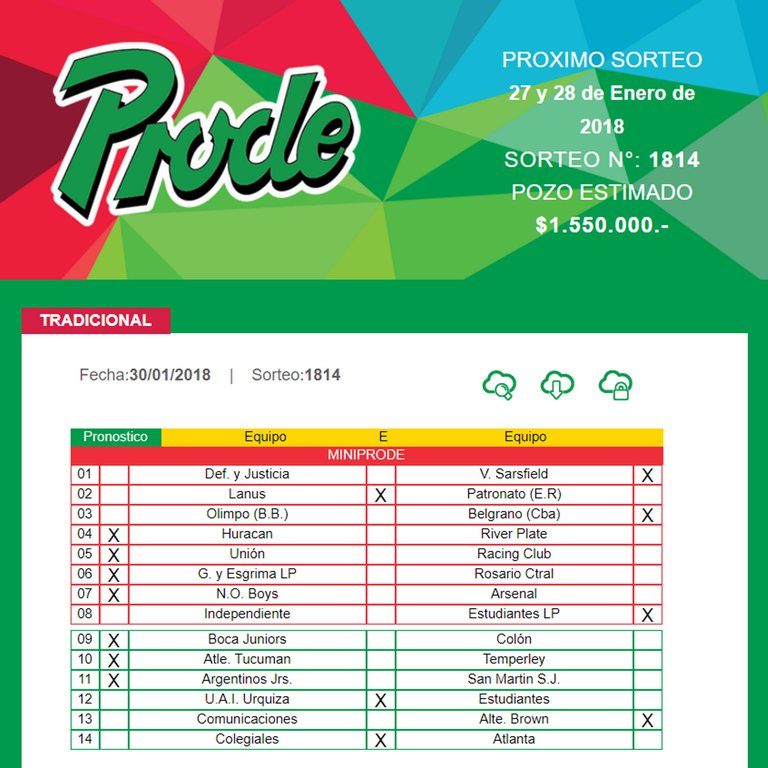
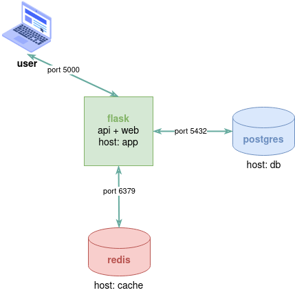

# Training app

## Prode

 

_"Pronósticos Deportivos"_ or _"PRODE"_ was a traditional bet game created by Argentina's national lottery agency ("Lotería Nacional") in 1972. Being just a board printed on paper, the player would bet, with a simple cross made inside a cell, the upcoming results of the week's local football tournament. The following development pays tribute to such a popular tradition, discontinued in 2018.

**Prode** is a forecasting game based on python and flask, which rewards users who guess the most match scores. The app compares the user's expected outcomes for each round against the latest results in the current seasons of European football leagues and makes a ranking with the sum of the points obtained by each player.

## Traning

Basic app architecture 

 

This application will be used throughout the docker and Kubernetes onboarding process as a starting point for testing and troubleshooting app migration to containers and orchestrators. Feel free to experiment with changing the app, running it locally, in docker containers, inside a Kubernetes deployment, etc. There is room for improvement here!

If you are following the onboarding process, its recommended to follow the proposed exercises listed below and review the story steps listed in [k8s-onboarding](https://www.football-data.org/) 

### 1. Run the application locally (optional)

Objective: Get familiar with package management strategies in Python with pip and leverage working simultaneously with several projects with venv.
Like npm in javascript, composer in PHP, or RubyGems in ruby, learning to use package managers is crucial to allow an application to run anywhere, despite the runtime environment or platform used.

### 2. Run the application in docker

Objective: Get familiar with docker commands. How do we build a docker image? What is a Dockerfile? How do we run a container and connect it with other running containers? How can I troubleshoot issues in docker?

### 3. Run the application in docker-compose

Objective: Getting to know docker-compose. Why do we have to execute many docker commands to deploy an application? Can we definite all running parameters and requisites in just one YAML file?

### 4. Run the application in Kubernetes

Objective: Connect the docker world with Kubernetes objects like pods, replicasets, and deployments. Get familiar with kubectl common commands, Kubernetes manifests, troubleshooting basics, and understand the need for Kubernetes. How can we scale the application to satisfy user requests? 

### 4. Leverage Kubernetes features

Objective: How can we leverage the power of the cloud regarding storage, computing, security, and networking?

***Thanks to [Guido](https://github.com/guidomitolo) and [football-data](https://www.football-data.org/)***
