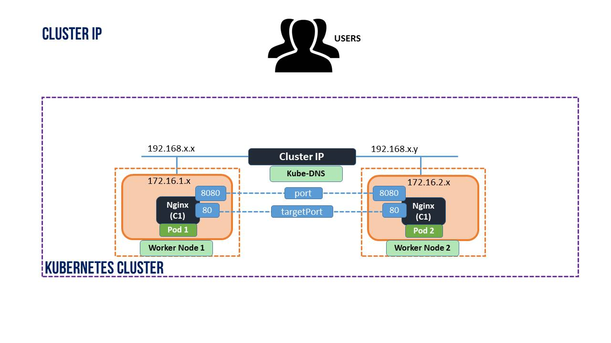
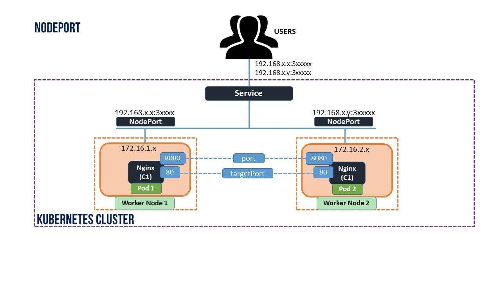
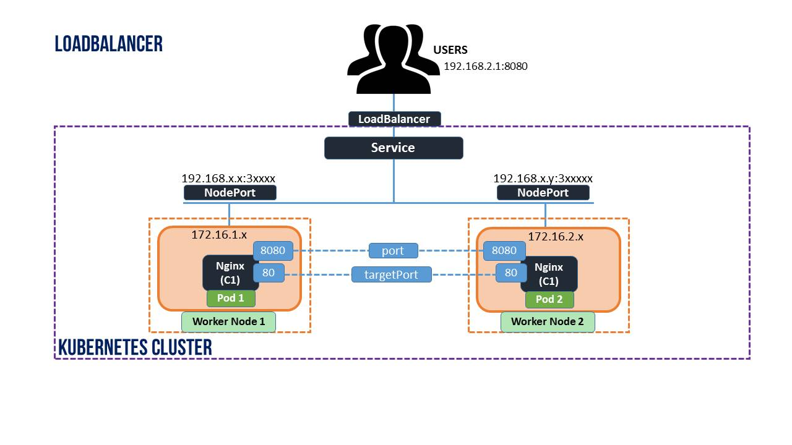

# Services

The Service resource is a crucial component of a Kubernetes cluster. In Kubernetes, a Service is a method for exposing a network application that is running as one or more Pods in your cluster. Only from the worker node where deployed pods are running can be accessed. And it cannot be accessed even from your kubernetes master nodes or from any other nodes until it is exposed through service. Because **each pods get its IP address through CNI plugin only from the local host.**  In Order to access the application over the network, use kubernetes service to expose the pods to external traffic and load balancing the traffic across multiple pods.

## Types of Kubernetes Services
These services can be used in different ways based on the types.

### ClusterIP
Exposes the Service on a cluster-internal IP. Choosing this value makes the Service only reachable from within the cluster. You can expose the Service to the public internet using an Ingress or a Gateway.


### NodePort
Exposes the Service on each Node's IP at a static port (the NodePort) using NAT. To make the node port available, Kubernetes sets up a cluster IP address, the same as if you had requested a Service of type: ClusterIP. Makes a Service accessible from outside the cluster using \<NodeIP>:\<NodePort>. Superset of ClusterIP.

Using a NodePort gives you the freedom to set up your own load balancing solution, to configure environments that are not fully supported by Kubernetes, or even to expose one or more nodes' IP addresses directly.




### LoadBalancer
Kubernetes does not directly offer a load balancing component; you must provide one, or you can integrate your Kubernetes cluster with a cloud provider. I assigns a fixed, external IP to the Service. Superset of NodePort.



### ExternalName
Exposes the Service using an arbitrary name (specified by externalName in the spec) by returning a CNAME record with the name.


# Create services

##  Frontend
- Create a namespace called frontend.
```console
$ kubectl create namespace frontend
namespace/frontend created
```
- Create a pod with the name http-frontend, the image nginx:latest, listening on port 80.
```console
$  kubectl create deployment http-frontend --image=nginx:latest --port=80 --namespace=frontend
deployment.apps/http-frontend created
```
- Expose the pod with a NodePort service type.
```console
$ kubectl expose deployment http-frontend --type=NodePort --port=80 --name=frontend
service/frontend exposed
```

```console
$ minikube -p netrix-k8s-workshop service frontend -n frontend --url
http://127.0.0.1:62787
```

> `minikube service frontend --url` runs as a process, creating a tunnel to the cluster. The command exposes the service directly to any program running on the host operating system.
## Cache
- Create a namespace called cache. 
```console
$ kubectl create namespace cache
namespace/cache created
```
- Create a pod with the image redis:latest, the name redis-cache, listening on port 6379.
```console
$ kubectl create deployment redis-cache --image=redis:latest --port=6379 --namespace=cache  
deployment.apps/redis-cache created
```
- Create a Service resource redis-cache-svc of type ClusterIP and attach it to the redis pod.
```console
$ kubectl expose deployment redis-cache --type=ClusterIP --port=6379 --name=cache             
service/cache exposed
```

# Tests
Test connection between both application services: Get the default nginx root page through your host.

Run the following command to create a new client pod and get into its terminal.
```console
$ kubectl run test-$RANDOM --namespace=default --rm -i -t --image=ubuntu -- sh
```
Install in the new pod the packages redis-tools and curl
Do http request via curl to the the http frontend Service FQDN. Don't use the Service IP address. The FQDN has the form of `service.namespace.svc.cluster.local`
```console
$ curl frontend.frontend.svc.cluster.local
<!DOCTYPE html>
<html>
<head>
<title>Welcome to nginx!</title>
<style>
html { color-scheme: light dark; }
body { width: 35em; margin: 0 auto;
font-family: Tahoma, Verdana, Arial, sans-serif; }
</style>
</head>
<body>
<h1>Welcome to nginx!</h1>
<p>If you see this page, the nginx web server is successfully installed and
working. Further configuration is required.</p>

<p>For online documentation and support please refer to
<a href="http://nginx.org/">nginx.org</a>.<br/>
Commercial support is available at
<a href="http://nginx.com/">nginx.com</a>.</p>

<p><em>Thank you for using nginx.</em></p>
</body>
</html>
```

Do a redis PING to the redis cache Service FQDN. Don't use the Service IP address.
```console
# redis-cli -h cache.cache.svc.cluster.local PING
PONG
```
Guidelines:
Put the 'workshop: lab9_services' label to your resources.
If you want to test the external connection against the frontend's NodePort Service, run:
$ minikube -p netrix-k8s-workshop service httpd-frontend-svc -n frontend
